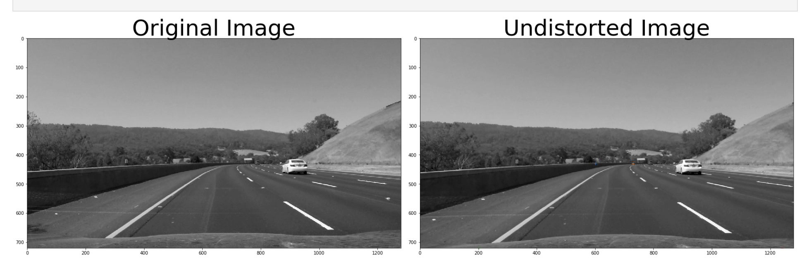
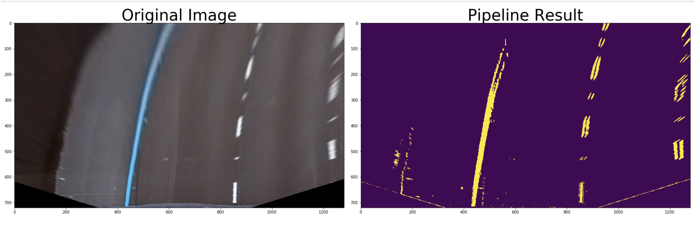
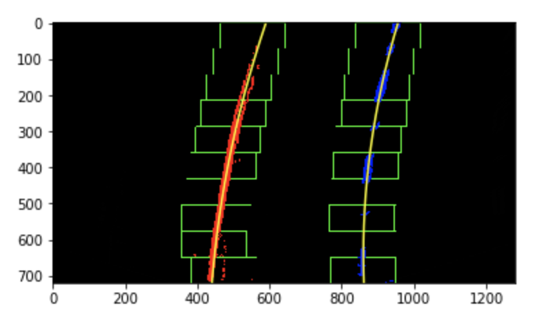
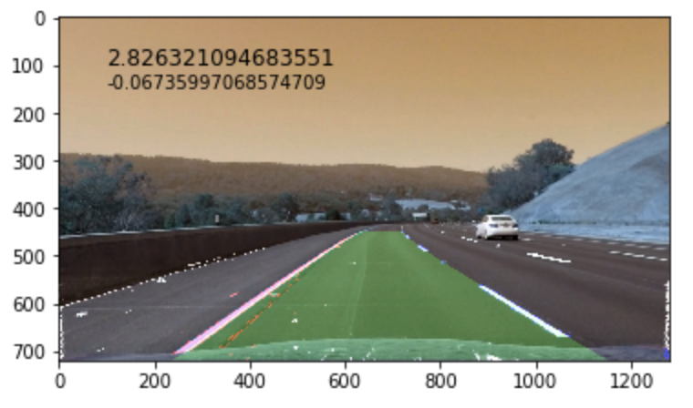

# **Advanced Lane detection** 

## Writeup Ricardo Rambal 


---

**Finding Lane Lines on the Road**
* Make a pipeline that finds lane lines on the road.

---

### Reflection

### 0. Pre-pipeline.
1. Get the data set (camera_cal) to calibrate the cameras and find the camera matrix and distortion coefficients, will be used in each frame of the video input. as this camera doesn't change trough out the video, there is no need to place it into the pipeline

```
def calibrate(images):

    # prepare object points, like (0,0,0), (1,0,0), (2,0,0) ....,(6,5,0)
    objp = np.zeros((6*9,3), np.float32)
    objp[:,:2] = np.mgrid[0:9,0:6].T.reshape(-1,2)

    # Arrays to store object points and image points from all the images.
    objpoints = [] # 3d points in real world space
    imgpoints = [] # 2d points in image plane.

    # Make a list of calibration images
    images = glob.glob(images)

    # Step through the list and search for chessboard corners
    for fname in images:
        img = cv2.imread(fname)
        gray = cv2.cvtColor(img,cv2.COLOR_BGR2GRAY)
        # Find the chessboard corners
        ret, corners = cv2.findChessboardCorners(gray, (9,6),None)
        # If found, add object points, image points
        if ret == True:
            objpoints.append(objp)
            imgpoints.append(corners)
            img = cv2.drawChessboardCorners(img, (9,6), corners, ret)
            ret, mtx, dist, rvecs, tvecs = cv2.calibrateCamera(objpoints, imgpoints, gray.shape[::-1], None, None)
            #Extract Numbers to calibrate 

    return ret, mtx, dist, rvecs, tvecs
```

### 1. Describe your pipeline pipeline.ipby,  this proccess is better shown at playgorund.ipynb

1. read the frame and apply a undistort to conpensate for the camera distortion using the returns from previews step.



2. warp flatten this image to presive better the line curvatures
3. apply tresholding including gaussian to start filtering the images
4. apply sobel to filter out the non vertical consecutive dots 
5. apply color channel transform HSL and filter by Saturation, this helps getting a better result finding yellow and white lanes 



6. divide on 2 arrays the image left and right half to find the lanes by applying polyfits, after 
7. make windows of selection pixels around the polyfit to evaluate the next polyfit, leaving out multiple noise pixels and sudden changes
8. draw the lanes



9. use the lines to calculate the radius and set it into a meter format by mapping the ratio meters to pixels 
10. use the bottom points of both lines and the middle point of the image to calculate the distance between the center of the car and the center of the lane



11. unwarp image into calibrated form and add upp the result and the main undistorted image
12. place the text on top of each final consolidated frame.

```
    dst = undistort(image, mtx, dist) #1.
    binary_warped = wraping(dst) #2.
    gobeled = detection(binary_warped) #3, 4, 5
    out_img = fit_polynomial(gobeled) #6, 7 
    result, left_curverad, right_curverad, average_km, offset = search_around_poly(gobeled) #7, 8, 9 and 10
    consolidated = cv2.addWeighted(unwraping(result), 0.8, dst, 1, 0) #11
    
    #12
    cv2.putText(consolidated,'{}{}'.format("%.4f"%average_km, " Km Curve R"),(100,100), font, 1,(255,255,255),2,cv2.LINE_AA)
    cv2.putText(consolidated,'{}{}'.format("%.3f"%offset," m distance to lane's center"),(100,150), font, 0.5,(255,255,255),2,cv2.LINE_AA)    
    plt.imshow(consolidated)
```

### 3. shortcomings 

There is a lot of more work to be done filtering the lane detection the goal would be to make it more stable. shadows and high contrast pavment changes are still unsolved by my code also crossing lane cars. 

### 3. Possible improvements

maybe more mixture of channels filtering, also i would like to try and tell the program to only allow coherent changes regarding the previews results applaying some kind of region masking, the problem would be when lane crossing?. 


### Special thanks 
To David Cardozo, also member of this group of students who explained me some more sofisticated forms of filtering and tresholding. 